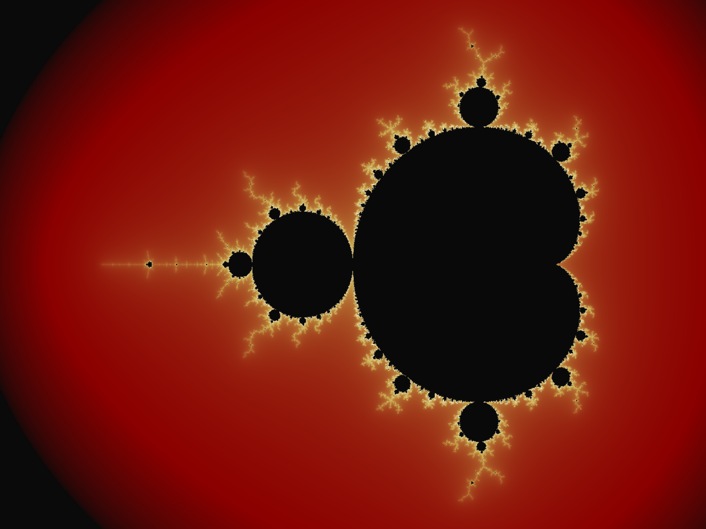

# Hybrid Architect Lab

**Computational engineering. 3D modeling. Visual identity systems. Applied ML.**

Built by **Rizky "Kiki" Meilandi Saputra** — Hybrid Architect from South Tangerang, Indonesia.

---

## Philosophy

Precision without aesthetic intention leaves a system incomplete.
Aesthetic vision without structural integrity leaves it unreliable.
This repository builds at the convergence of those two requirements.

Every project here follows one standard: a system is not finished until
it holds under pressure and reads as intentional.

---

## Active Projects

### Fractal Visualizer — Chaos Theory in Python
Mandelbrot set visualization demonstrating chaos theory principles.
Custom Neo-Classical color mapping: deep red through gold to white at
maximum iteration depth. Built with NumPy and Matplotlib.

**Status:** Complete

**Stack:** Python 3.14, NumPy, Matplotlib

**Folder:** `/fractal-visualizer`

---

### VTOL Drone Parameter Calculator
Engineering tool for calculating thrust-to-weight ratios, propeller
sizing, power draw, and real-world flight endurance for configurable
VTOL drone systems. Directly tied to active firefighting drone
development work.

Sample output: 12.5 kg hexacopter, 6× motors, 44.4V / 22Ah battery,
15" props, TWR 2.2 — estimated hover endurance 10.5 minutes
real-world corrected.

**Status:** Complete

**Stack:** Python 3.14 (stdlib only — no dependencies)

**Folder:** `/vtol-calculator`

---

### VTOL Motor Arm — Parametric CAD
Fully parametric motor arm for VTOL drone applications. 13 variables
drive all geometry — cross-section, hollow shell, motor boss, bolt
pattern, internal ribs, lightening pockets, fillets, and chamfers.
Variable-driven architecture validated across two motor interface
configurations: 38mm boss / 16mm BCD (primary) and 45mm boss / 19mm BCD.

**Status:** Complete

**Stack:** Onshape (parametric CAD), Blender (Cycles render), STEP AP242

**Folder:** `/vtol-motor-arm`

---

### Magnetic Linear Accelerator Simulation
Physics simulation modeling Lorentz force behavior in a magnetic
linear accelerator. Visualizes electromagnetic field interactions
and projectile velocity across acceleration stages.

**Status:** Complete

**Stack:** Python 3.14, NumPy, Matplotlib (stdlib only — no physics libraries)

**Folder:** `/mag-accelerator-sim`

---

## Visual Identity System

All projects in this repository reflect the **Neo-Classical Engineering**
aesthetic system:

| Element | Value |
|---|---|
| Background | `#0a0a0a` |
| Primary | `#f5f0eb` |
| Accent | `#8b0000` |
| Metal | `#c9a84c` |
| Code font | JetBrains Mono |

Vintage soul. Modern precision.

---

## Stack Overview

| Domain | Tools |
|---|---|
| Languages | Python, C++, JavaScript, HTML |
| Environments | VS Code |
| 3D Modeling | Blender (bpy), Onshape |
| Data & ML | NumPy, Matplotlib |
| Design | Canva, custom SVG systems |

---

## Contact

**LinkedIn:** linkedin.com/in/rizky-m-b4904838a

**Email:** rizky.meilandi007@gmail.com

**Location:** South Tangerang, Indonesia

**Open to:** Remote and hybrid roles — Indonesia and international

---

*This repository is actively under development.
Projects are added as they are built, not before.*
