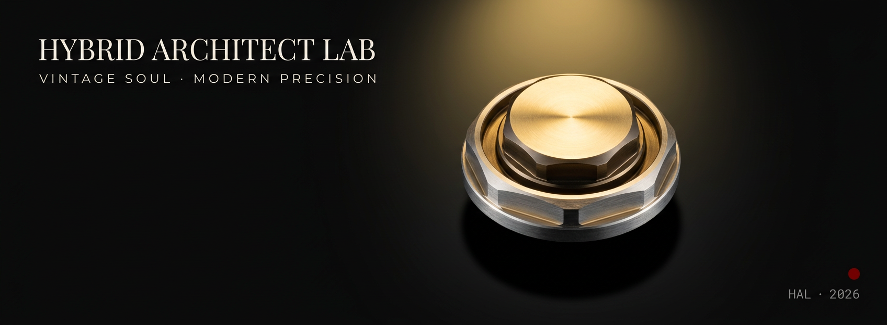

# Hybrid Architect Lab

**Computational engineering. Parametric CAD. Physics simulation. Visual identity systems.**

Built by **Rizky "Kiki" Meilandi Saputra** — Hybrid Architect from South Tangerang, Indonesia.

---

## Philosophy

Precision without aesthetic intention leaves a system incomplete.  
Aesthetic vision without structural integrity leaves it unreliable.

This repository builds at the convergence of those two requirements.
Every project here follows one standard: a system is not finished until it holds under pressure and reads as intentional.

---

## Project index

Each folder is documented as a standalone mini-project with the same structure: what it is, context, output, how to run or view it, interesting technical details, stack, files, and a closing note.

| Project | Domain | Result | Folder |
|---|---|---|---|
| Fractal Visualizer | Mathematical visualization | 1200×900 Mandelbrot render with smooth coloring | [`fractal-visualizer/`](fractal-visualizer/) |
| VTOL Drone Parameter Calculator | Aerospace / multirotor sizing | 12.5 kg hexacopter feasibility sheet, ~10.5 min corrected hover estimate | [`vtol-calculator/`](vtol-calculator/) |
| VTOL Motor Arm | Parametric CAD + render pipeline | 13-variable Onshape model, STEP AP242 export, Blender Cycles render | [`vtol-motor-arm/`](vtol-motor-arm/) |
| Magnetic Linear Accelerator Simulation | Electromagnetic physics simulation | 122.57 m/s final velocity, 39.1% simulated energy efficiency | [`mag-accelerator-sim/`](mag-accelerator-sim/) |

---

## Fractal Visualizer — chaos theory in Python

Mandelbrot set visualization demonstrating deterministic chaos through a custom Neo-Classical palette: black interior, deep red boundary compression, gold mid-range escape, and white fast-escape field.


**Highlights**

- Vectorized NumPy computation over a 1200×900 grid
- Smooth-coloring renormalization to remove iteration banding
- Custom 4-stop colormap tuned for boundary density
- Cross-platform output path and project-level README

**Stack:** Python 3.10+ minimum (developed on 3.14), NumPy, Matplotlib  
**Folder:** [`fractal-visualizer/`](fractal-visualizer/)

---

## VTOL Drone Parameter Calculator

Interactive command-line calculator for VTOL firefighting multirotor sizing. It estimates thrust per motor, hover current draw, theoretical endurance, real-world corrected endurance, TWR compliance, and operating-boundary warnings.

**Reference configuration**

```text
Total drone weight : 12.50 kg
Motors             : 6
Battery            : 44.4 V / 22000 mAh
Propeller          : 15 inches
Target TWR         : 2.2 : 1
Estimated hover    : 12.8 min theoretical / ~10.5 min real-world corrected
TWR compliance     : PASS
```

**Highlights**

- Zero dependencies — pure standard library
- Clean phase separation: input → validation → calculation → render
- Formula-rich terminal output that doubles as an engineering reference sheet
- Constants block keeps assumptions visible and adjustable

**Stack:** Python 3.10+ minimum (developed on 3.14), standard library only  
**Folder:** [`vtol-calculator/`](vtol-calculator/)

---

## VTOL Motor Arm — parametric CAD

Fully parametric motor arm for VTOL drone applications. Thirteen named Onshape variables drive the geometry: cross-section, hollow shell, motor boss, bolt pattern, internal ribs, wire bore, fillets, and chamfers.


**Highlights**

- Current motor interface: 38 mm boss / 16 mm BCD
- Alternate validation configuration: 45 mm boss / 19 mm BCD
- Public Onshape model linked from the project README
- STEP AP242 export for cross-CAD compatibility
- Blender Cycles render pipeline with scripted material, lighting, and camera setup

**Stack:** Onshape, STEP AP242, Blender 5.1 Cycles, Python render script  
**Folder:** [`vtol-motor-arm/`](vtol-motor-arm/)

---

## Magnetic Linear Accelerator Simulation

Numerical physics simulation of a three-stage magnetic linear accelerator. The project models finite-solenoid field geometry, underdamped RLC capacitor discharge, magnetic force coupling, RK4 projectile dynamics, multi-stage chaining, and trigger-spacing optimisation.


**Final simulated result**

```text
v_final     = 122.57 m/s
Total ΔKE   = 375.6 J of 960 J
η_total     = 39.1%
Crossover   = 283.9 mm minimum viable stage spacing
```

**Highlights**

- Six conceptual physics steps implemented across five Python modules
- Analytical verification before rendering field, circuit, and dynamics plots
- Stage-spacing sweep explains the jump from 67.88 m/s to 122.57 m/s
- Explicit explanation of the Stage 2 `101.4%` spatial attribution artifact
- Safety/scope note included: simulation only, not a hardware build guide

**Stack:** Python 3.10+ minimum (developed on 3.14), NumPy, Matplotlib  
**Folder:** [`mag-accelerator-sim/`](mag-accelerator-sim/)

---

## Visual identity system

All projects in this repository use the **Neo-Classical Engineering** aesthetic system:

| Element | Value | Role |
|---|---|---|
| Background | `#0a0a0a` | black technical field |
| Primary | `#f5f0eb` | warm white text |
| Accent | `#8b0000` | deep red signal / warning / rose |
| Metal | `#c9a84c` | gold titles and technical highlights |
| Secondary metal | `#b8c1c8` | silver instrumentation |
| Code font | JetBrains Mono | technical voice |

Vintage soul. Modern precision.

---

## Repository stack

| Domain | Tools |
|---|---|
| Programming | Python 3.10+ minimum (developed on 3.14) |
| Numerical computing | NumPy |
| Visualization | Matplotlib |
| CAD | Onshape |
| Rendering | Blender Cycles, Python `bpy` scripting |
| Design | Canva, custom SVG / PNG visual systems |
| Documentation | Markdown, GitHub README system |

---

## Contact

**LinkedIn:** [linkedin.com/in/rizky-m-b4904838a](https://linkedin.com/in/rizky-m-b4904838a)  
**Email:** [rizky.meilandi007@gmail.com](mailto:rizky.meilandi007@gmail.com)  
**Location:** South Tangerang, Indonesia  
**Open to:** Remote and hybrid roles — Indonesia and international

---

*This repository is actively maintained. Projects are added as they are built, not before.*
