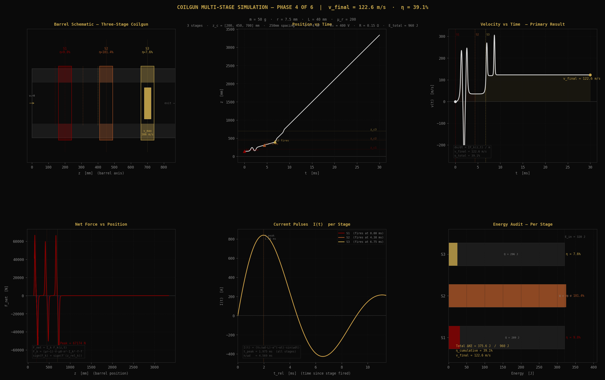
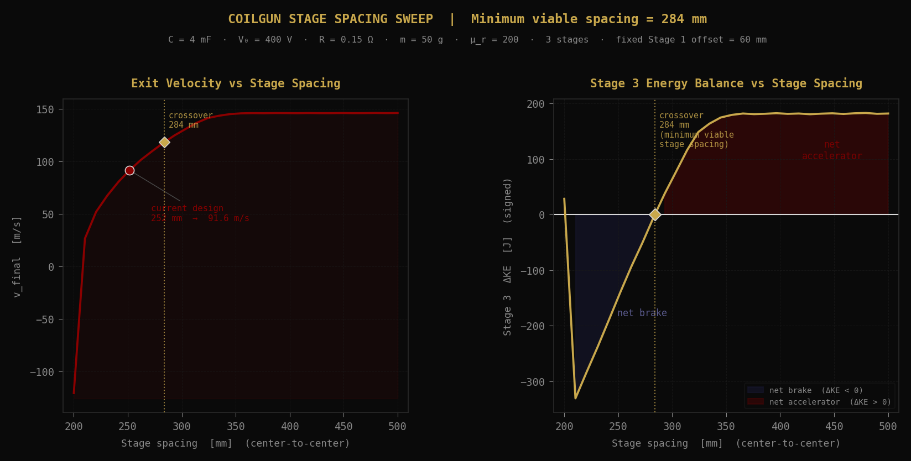
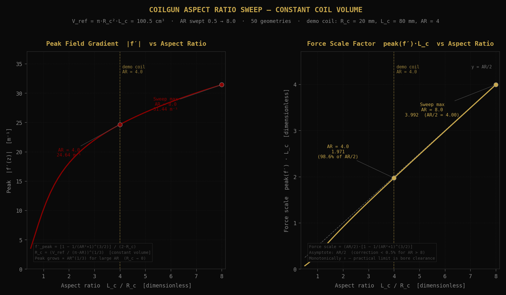

# Magnetic Linear Accelerator Simulation

> Multi-stage coilgun physics simulation in Python.
> Field model, RLC discharge, force coupling, RK4 dynamics, multi-stage chaining, and trigger-spacing optimisation — all explicit, no black-box physics libraries.



---

## What it is

A numerical simulation suite for a three-stage magnetic linear accelerator. It models the full chain from finite-solenoid field geometry to capacitor discharge, magnetic force coupling, single-stage projectile dynamics, and final multi-stage trigger timing.

The final configuration reaches:

- **Final velocity:** `122.57 m/s`
- **Total kinetic-energy gain:** `375.6 J`
- **Total efficiency:** `39.1%` of `960 J` stored capacitor energy
- **Minimum viable stage spacing:** `283.9 mm`

The project is intentionally transparent: every governing equation is implemented directly in Python using NumPy and Matplotlib. No external physics engine is used.

---

## Physics context

The simulator covers six conceptual steps, implemented across five Python modules:

| Conceptual step | What it solves | File |
|---:|---|---|
| 1 | Finite-solenoid field profile `f(z)` and gradient `f′(z)` | `coilgun_field_model.py` |
| 1 extension | Constant-volume coil aspect-ratio sweep | `coilgun_aspect_sweep.py` |
| 2 | Underdamped RLC capacitor discharge current `I(t)` | `coilgun_rlc_model.py` |
| 3 | Magnetic force coupling `F_z(z,t)` | `coilgun_dynamics.py` |
| 4 | Single-stage RK4 projectile integration | `coilgun_dynamics.py` |
| 5 | Three-stage chaining | `coilgun_simulation.py` |
| 6 | Trigger / spacing optimisation | `coilgun_simulation.py` |

The core force expression is:

```text
F_z(z,t) = (μ_r − 1) · V_proj · μ₀ · n² · I(t)² · f(z) · f′(z)
```

That equation is the bridge between the field model, the circuit model, and the projectile dynamics:

- `f(z)` and `f′(z)` come from the finite-solenoid geometry.
- `I(t)` comes from the underdamped RLC discharge.
- `F_z(z,t)` is integrated through time with RK4 to update projectile position and velocity.

---

## What it produces

### Final three-stage result

Running the final simulation gives:

```text
Stage     z_trigger   z_center    Entry v      ΔKE       η
──────────────────────────────────────────────────────────────────
Stage 1         140 mm       200 mm       0.0 m/s    31.2 J    9.8%
Stage 2         309 mm       450 mm      34.9 m/s   324.5 J  101.4%
Stage 3         400 mm       700 mm      89.3 m/s    24.4 J    7.6%
──────────────────────────────────────────────────────────────────
Total ΔKE   = 375.6 J  of 960 J  (3 × 320 J)
v_final     = 122.57 m/s
η_total     = 39.12%
```

The six-panel render at the top of this README shows:

1. barrel schematic and stage positions
2. projectile position over time
3. velocity over time
4. net force over barrel position
5. current pulses per stage
6. per-stage energy audit

### Stage-spacing sweep

The spacing sweep shows why the final trigger geometry matters:



Key result:

```text
Stage 3 crossover = 283.9 mm
```

Below roughly `284 mm`, Stage 3 is a net brake for this circuit and projectile. Above that point, Stage 3 becomes a net accelerator. Beyond roughly `360 mm`, the sweep plateaus near:

```text
v_final ≈ 146 m/s
η_total ≈ 55.6%
```

### Aspect-ratio sweep

The aspect-ratio sweep isolates coil geometry at constant coil volume:



The result is monotonic over the studied range: longer, narrower coils improve the force scale at fixed coil volume until practical constraints — bore clearance, wire gauge, packaging, and manufacturing — become the real limits.

---

## How to run it

Install dependencies:

```bash
pip install -r requirements.txt
```

Run the final three-stage simulation:

```bash
python coilgun_simulation.py
```

Run the final simulation and spacing sweep:

```bash
python coilgun_simulation.py --sweep
```

Write outputs to custom paths:

```bash
python coilgun_simulation.py --output ./renders/coilgun_neoclassical.png
python coilgun_simulation.py --sweep --sweep-output ./renders/coilgun_spacing_sweep.png
```

Run the individual analysis modules:

```bash
python coilgun_field_model.py
python coilgun_aspect_sweep.py
python coilgun_rlc_model.py
python coilgun_dynamics.py
```

Each script saves a Neo-Classical PNG figure to the current folder by default.

---

## The interesting bits

### Six physics concepts, five scripts

The original architecture had six conceptual steps, not six required files. The implementation merges concepts where they naturally belong:

- force coupling and RK4 single-stage integration live together in `coilgun_dynamics.py`
- multi-stage chaining and trigger optimisation live together in `coilgun_simulation.py`

That is intentional. Splitting those pairs into separate scripts would create artificial boundaries without improving the model.

### Timing diagnosis — why the sweep mattered

The first multi-stage version capped trigger offset at `200 mm`. That produced:

```text
v_final = 67.88 m/s
η_total = 12.0%
```

The problem was not capacitor energy. It was timing. At the old cap, Stage 3 fired too late geometrically relative to projectile travel through the coil. The projectile reached the wrong part of the force cycle and Stage 3 failed to contribute useful kinetic energy.

The corrected version raises the trigger offset cap to `300 mm`, allowing Stage 3 to fire earlier relative to its center position. With the corrected trigger geometry:

```text
v_final = 122.57 m/s
η_total = 39.1%
```

Same three stages. Same capacitor energy. Better trigger timing.

### Why Stage 2 shows 101.4%

Stage 2 reports `101.4%` efficiency in the per-stage table. That is not a conservation-of-energy violation. It is a spatial attribution artifact.

The per-stage audit measures kinetic-energy change across fixed spatial windows around each coil. Some momentum entering the Stage 2 window was accumulated during inter-stage coasting, so the local window can attribute slightly more energy to that stage than its capacitor alone delivered.

The full-system energy check is the important one:

```text
Total ΔKE = 375.6 J of 960 J
η_total   = 39.1%
```

The total system remains well inside the stored-energy budget.

### Analytical verification before rendering

The first three modules verify their physics before producing figures:

- `coilgun_field_model.py` verifies field symmetry, center value, far-field decay, and gradient antisymmetry.
- `coilgun_rlc_model.py` verifies initial conditions, peak current, zero crossing, and energy conservation through `∫I²R dt = ½CV₀²`.
- `coilgun_dynamics.py` verifies force sign, force antisymmetry, zero-force conditions, and single-stage energy bounds.

The visual outputs are therefore not just plots — they are plots backed by checks.

### Known simplifications

The model intentionally keeps several real-world effects simplified:

- constant relative permeability `μ_r = 200` — ignores saturation above roughly `1.5 T`
- force evaluated at projectile centroid — about `10%` spatial approximation
- constant coil inductance — real inductance rises as the slug enters the bore
- no eddy-current drag
- no friction
- no gravity
- no thermal model
- no switching-device losses

These are documented limitations, not hidden assumptions. The project is a numerical study of timing, staging, and energy flow — not a hardware-validated launcher model.

---

## Stack

- Python 3.10+ minimum (developed on 3.14)
- NumPy ≥ 1.24
- Matplotlib ≥ 3.7
- No external physics libraries

---

## Files

```text
mag-accelerator-sim/
├── coilgun_field_model.py        # Step 1 — finite-solenoid field profile and gradient
├── coilgun_aspect_sweep.py       # Step 1 extension — constant-volume geometry sweep
├── coilgun_rlc_model.py          # Step 2 — underdamped RLC discharge
├── coilgun_dynamics.py           # Steps 3-4 — force coupling + RK4 single-stage dynamics
├── coilgun_simulation.py         # Steps 5-6 — multi-stage chaining + trigger/spacing optimisation
├── coilgun_field_analysis.png    # Step 1 field render
├── coilgun_aspect_sweep.png      # Aspect-ratio sweep render
├── coilgun_rlc_analysis.png      # Step 2 RLC render
├── coilgun_dynamics.png          # Steps 3-4 dynamics render
├── coilgun_neoclassical.png      # Final six-panel three-stage render
├── coilgun_spacing_sweep.png     # Trigger/spacing optimisation render
├── requirements.txt              # NumPy + Matplotlib runtime requirements
└── README.md                     # This file
```

---

## Scope and safety note

This project is a numerical physics simulation and visualization study. It is not a hardware build guide, firing procedure, or construction manual.

High-current capacitor systems, pulsed magnetic coils, and projectile accelerators are dangerous. The code is presented for educational modeling, verification practice, and portfolio demonstration only.

---

> *The projectile does not accelerate because the coils are strong.*
> *It accelerates when field, current, and timing agree for a few milliseconds.*
> *The simulation is the search for that agreement.*
