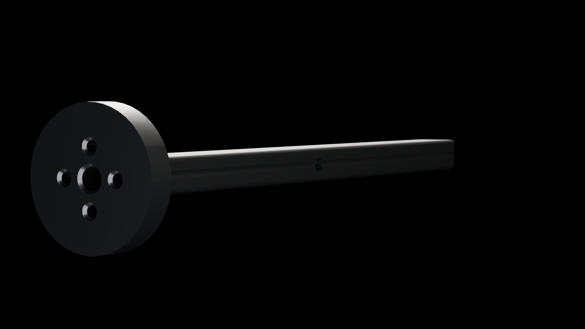

# VTOL Motor Arm — Parametric CAD

> Fully parametric carbon-fiber motor arm for VTOL drone applications.
> 13 named variables drive all geometry. Designed in Onshape, rendered in Blender Cycles.



---

## What it is

A single-piece structural arm that connects a multirotor motor to the airframe
center, with the motor mount integrated as part of the same body. It is
*fully parametric* — every dimension is driven by a named variable in an
Onshape Variable Studio, so the entire geometry rebuilds itself if any
parameter changes. Validated across two motor interface configurations to
prove the parametric system holds under real configuration variance.

Exported to STEP AP242 for cross-CAD compatibility. Rendered in Blender 5.1
Cycles with a custom Neo-Classical material setup.

## Design context

Three engineering decisions shape this part:

- **Integrated motor mount** — most drone arm designs separate the boom from
  the motor mount as two parts joined by bolts. This consolidates them into a
  single piece, reducing weight and removing a known stress concentration at
  the bolt joint. Trade-off: the part is harder to manufacture as a single
  pocket-machined or CNC'd piece, but trivial to 3D-print or invest-cast.

- **Hollow shell with internal ribs** — the tube cross-section (20 × 14 mm)
  is hollowed out to a 2.5 mm wall, then reinforced with internal ribs at
  1.8 mm thickness × 8 mm depth. The shell carries the bending load, the
  ribs prevent the shell from buckling under propeller thrust transients.
  Approximately the same stiffness as a solid bar at ~40% of the mass.

- **Variable-driven architecture** — 13 named parameters drive every feature
  in the part. This means resizing the part for a different motor or arm
  length is editing a single value in a table, not re-modeling. Validated by
  successfully rebuilding the part for both 38 mm / 16 mm BCD (current) and
  45 mm / 19 mm BCD motor interfaces without any geometry-tree edits.

## What it produces

A real, manufacturable part with measurable properties:

| Property | Value |
|---|---|
| Total arm length | 180 mm |
| Cross-section (W × H) | 20 × 14 mm |
| Shell wall thickness | 2.5 mm |
| Motor boss diameter | 38 mm (current config) |
| Motor bolt circle (BCD) | 16 mm (M3 hardware) |
| Volume | 22,858 mm³ |
| Surface area | 14,601 mm² |
| Features in tree | 21 |
| Export format | STEP AP242 Edition 2 |

The rendered image above is produced by the Blender script in this folder
using the exported geometry, with a matte dark-aluminum PBR material
(metallic 0.92, roughness 0.28, base color `#0a0a0a`) and 3-point lighting.

## How to view it

There are three ways to inspect this design, from least to most setup:

### 1. View live in your browser — no software needed

The Onshape document is public. Open it, spin the model in 3D, inspect the
variable table, see the dimension tree:

**→ [Open VTOL Motor Arm in Onshape](https://cad.onshape.com/documents/83b89dd03b2c505ae399a8bb/w/f876e47ff6f40dede03fed47/e/afa810a5c7523899e6760c96)**

This is the fastest way to see the parametric system in action. Click the
*Variables* tab to see all 13 named parameters with their current values.

### 2. Open the STEP file in any CAD package

The `VTOL Motor Arm.step` file in this folder is an industry-standard
exchange format. It opens in FreeCAD, Fusion 360, SolidWorks, Onshape,
Inventor, NX, CATIA, or any other parametric CAD tool — for free in
FreeCAD's case.

### 3. Reproduce the render in Blender

```
1. Open Blender 5.1 (Cycles render engine)
2. Clear default objects (A → X → Delete in 3D Viewport)
3. File → Import → STEP (requires the STEP-import addon enabled)
   OR import the OBJ if you have it converted locally
4. Scripting tab → open vtol_arm_render.py → Run Script (Alt+P)
5. Press F12 to render
```

Output: `vtol_arm_neoclassical.png` next to your `.blend` file.

The script sets up the material, lighting, camera, and Cycles render
parameters automatically — it does not handle geometry import (which is
manual in Blender's GUI).

## The interesting bits

### The 13 parameters that drive everything

Every feature in the tree references one of these named variables. Change a
value, the whole part rebuilds. No broken references, no manual cleanup.

| Variable | Value | Purpose |
|---|---|---|
| `#arm_length` | 180 mm | Total arm span |
| `#arm_width` | 20 mm | Cross-section width |
| `#arm_height` | 14 mm | Cross-section height |
| `#wall_thickness` | 2.5 mm | Shell wall everywhere |
| `#wire_bore_diameter` | 6 mm | Internal wire routing channel |
| `#motor_boss_diameter` | 38 mm | Motor mount boss outer diameter |
| `#motor_boss_height` | 8 mm | Boss protrusion above arm |
| `#bolt_circle_diameter` | 16 mm | PCD of the 4 motor bolt holes |
| `#bolt_diameter` | 3 mm | M3 bolt clearance |
| `#rib_height` | 8 mm | Internal rib depth |
| `#rib_thickness` | 1.8 mm | Rib wall thickness |
| `#fillet_radius` | 1.5 mm | All exterior edges |
| `#chamfer_size` | 0.8 mm | Bore entries |

### Two-config validation proves the parametric system works

A parametric model that works for *one* configuration may have hidden
hard-coded geometry that breaks the moment a critical dimension changes.
The way to prove the system is genuinely parametric is to rebuild it for a
deliberately different configuration and verify nothing breaks.

This part was validated against two motor interfaces:

- **Current:** 38 mm motor boss · 16 mm bolt circle · M3 hardware (compatible with most 2216–2814 class brushless motors)
- **Alternate:** 45 mm motor boss · 19 mm bolt circle (compatible with larger 2820–3508 class motors)

Both configurations rebuild from the same feature tree by editing the
variable table. No manual geometry edits required.

### Blender render — material and lighting choices

The render setup script makes three engineering-as-aesthetic decisions:

- **Material:** PBR matte dark aluminum. Metallic 0.92 (essentially fully
  metallic), roughness 0.28 (low — gives a soft sheen rather than mirror
  reflection), base color `#0a0a0a` (the Neo-Classical void black).
- **Smooth shading with Edge Split modifier at 55°** — preserves crisp
  corners on the bolt holes and rib intersections while keeping curved
  surfaces (the boss cylinder, the fillet transitions) smoothly shaded.
- **3-point lighting** in the Cycles renderer — key light from one upper
  side, fill light from the opposite low side, rim light from behind to
  separate the part from the black background.

The script auto-detects whether the imported mesh is in millimeters or
meters and applies a scale correction. This matters because STEP files
typically export in mm but Blender's default unit is meters — without the
auto-detect, the part would render at 1000× its intended size.

## Stack

- **CAD:** Onshape (browser-based parametric CAD)
- **Render:** Blender 5.1 (Cycles render engine)
- **Render script:** Python 3.x via Blender's bundled `bpy` API
- **Export format:** STEP AP242 Edition 2 (industry-standard exchange)

## Files

```
vtol-motor-arm/
├── vtol_arm_neoclassical.png   # Hero render (Blender Cycles output)
├── VTOL Motor Arm.step         # Geometry export — open in any CAD tool
├── vtol_arm_render.py          # Blender material + lighting + camera setup
└── README.md                   # This file
```

The Onshape document is the source of truth — the STEP file is a downstream
export, and the Blender script consumes a manual import of that geometry.

---

> *A parametric model is a promise: change any number on the table, and the
> part still makes sense. This one keeps that promise across two motor
> interfaces and a hundred edits to thirteen variables.*
